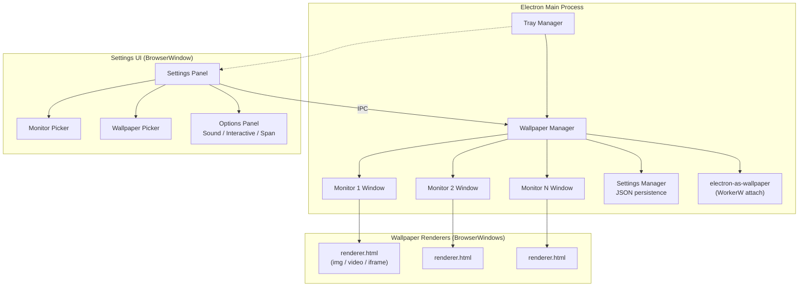

# Wallpaper Engine – Implementation Plan

A Windows desktop application that lets you set **static images, GIFs, videos, and HTML pages** as your desktop wallpaper — with full **multi-monitor** support, **sound control**, and **interactive HTML** mode.

---

## Architecture Overview



### Technology Stack

| Layer | Technology | Rationale |
|---|---|---|
| **Framework** | **Electron 34+** | Chromium handles all media (images, video, GIF, HTML). Node.js gives filesystem + Windows API access. |
| **Desktop Embedding** | **`electron-as-wallpaper`** | Handles the `WorkerW` / `Progman` hack to embed windows behind desktop icons. Supports mouse & keyboard forwarding for interactive HTML. Written in Rust (native addon). |
| **Settings Persistence** | **`electron-store`** | Simple JSON-based config store in `%APPDATA%`. Stores per-monitor wallpaper configs. |
| **UI Styling** | **Vanilla CSS** | Dark glassmorphism design with custom properties & animations. |
| **Build / Bundle** | **Electron Forge** | Handles dev workflow, native module rebuilding, and packaging into installer. |

> [!IMPORTANT]
> **`electron-as-wallpaper` requires Rust to be installed** on the build machine (it compiles a native Rust addon via `napi-rs`). You'll need the Rust toolchain (`rustup`) installed. If you don't have Rust installed, I'll guide you through it during setup.

---

## User Review Required

> [!IMPORTANT]
> **System Tray vs. Full Window**: The app will live in the **system tray** with a small settings window that opens on demand (like the real Wallpaper Engine). This means there's no taskbar window cluttering your desktop. Is this acceptable, or would you prefer a traditional windowed app?

> [!WARNING]
> **Windows Version Compatibility**: The `WorkerW` technique is an undocumented Windows hack. It works reliably on **Windows 10 and 11** but could break with future Windows updates. The app will include a fallback that detects failure and notifies the user. Are you okay with this known limitation?

> [!IMPORTANT]
> **Interactive HTML**: When "interactive" mode is enabled for an HTML wallpaper, mouse clicks go to the wallpaper instead of through to the desktop. You'd need to **disable** interaction to click desktop icons again (or use a hotkey toggle). Planned hotkey: `Ctrl+Alt+W` to toggle interaction on/off. Sound good?

---

## Open Questions

1. **Autostart**: Should the app launch automatically on Windows startup (with a toggle in settings)?
2. **Wallpaper Library**: Do you want a library/gallery view where you can browse previously used wallpapers, or is a simple file picker sufficient for now?
3. **GIF Rendering**: GIFs will be rendered via an `` tag in Chromium (which auto-animates). Should there be a pause/play control for GIFs?
4. **Video Looping**: Should videos loop by default? Should there be an option to toggle looping?
5. **HTML Sandbox**: Should HTML wallpapers be sandboxed (no access to Node.js / filesystem), or do you want them to run with full privileges?

---

## Proposed Changes

### Project Scaffolding

#### [NEW] `package.json`
- Electron app metadata, scripts (`dev`, `start`, `build`, `package`)
- Dependencies: `electron`, `electron-as-wallpaper`, `electron-store`
- Dev dependencies: `@electron-forge/cli`, `@electron-forge/maker-squirrel`

#### [NEW] `forge.config.js`
- Electron Forge configuration for dev server and packaging
- Native module rebuild configuration for `electron-as-wallpaper`

---

### Main Process (`src/main/`)

#### [NEW] `src/main/index.js`
Core Electron main process entry point:
- Creates the system tray with context menu
- Manages wallpaper `BrowserWindow` instances (one per monitor or one spanning)
- Handles IPC messages from the settings UI
- Monitors display changes (`screen.on('display-added')`, `display-removed`, `display-metrics-changed`)
- Attaches wallpaper windows using `electron-as-wallpaper`

#### [NEW] `src/main/wallpaper-manager.js`
Central wallpaper management logic:
- `applyWallpaper(monitorId, config)` — sets wallpaper for a specific monitor
- `applySpanning(config)` — creates a single window spanning all monitors
- `applySameToAll(config)` — applies the same wallpaper to every monitor
- `detachAll()` — removes all wallpapers
- `toggleSound(monitorId, enabled)` — IPC to renderer to mute/unmute
- `toggleInteractive(monitorId, enabled)` — re-attaches with `forwardMouseInput` toggled
- Handles wallpaper type detection (static image / GIF / video / HTML) from file extension

#### [NEW] `src/main/settings-store.js`
Persistent settings management using `electron-store`:
```js
{
  "monitors": {
    "monitor-1": {
      "wallpaperPath": "C:\\..\\wallpaper.mp4",
      "wallpaperType": "video",     // "image" | "gif" | "video" | "html"
      "soundEnabled": false,
      "interactive": false,
      "fit": "cover"                // "cover" | "contain" | "stretch" | "center"
    },
    "monitor-2": { ... }
  },
  "mode": "different",              // "same" | "different" | "spanning"
  "globalConfig": { ... },          // used when mode is "same" or "spanning"
  "autostart": true,
  "interactiveHotkey": "Ctrl+Alt+W"
}
```

#### [NEW] `src/main/tray.js`
System tray icon and context menu:
- Open Settings
- Pause/Resume Wallpaper
- Mute/Unmute All
- Disable Interaction
- Quit

---

### Wallpaper Renderer (`src/renderer/wallpaper/`)

#### [NEW] `src/renderer/wallpaper/index.html`
Minimal HTML page loaded by each wallpaper `BrowserWindow`:
- Receives wallpaper config via IPC
- Renders content based on type:
  - **Image/GIF**: `` element with object-fit
  - **Video**: `<video>` element with autoplay, loop, muted controls
  - **HTML**: `<iframe>` or `<webview>` loading the HTML file

#### [NEW] `src/renderer/wallpaper/renderer.js`
Wallpaper renderer logic:
- Listens for IPC messages: `set-wallpaper`, `toggle-sound`, `set-fit`
- Dynamically swaps content type
- Controls video playback, muting
- Handles iframe loading for HTML wallpapers

#### [NEW] `src/renderer/wallpaper/renderer.css`
Full-viewport styling:
- `html, body { margin: 0; overflow: hidden; width: 100vw; height: 100vh; background: black; }`
- Media element sizing (object-fit variants)

---

### Settings UI (`src/renderer/settings/`)

#### [NEW] `src/renderer/settings/index.html`
Premium dark-mode settings interface with sections:

1. **Monitor Layout Visualizer**
   - Visual representation of connected monitors (scaled rectangles)
   - Click a monitor to select it
   - Shows current wallpaper thumbnail on each

2. **Mode Selector**
   - 3 toggle options: **Same for All** | **Different per Monitor** | **Span Across**
   - Visual icons for each mode

3. **Wallpaper Picker**
   - Drag-and-drop zone + file browser button
   - Accepts: `.png`, `.jpg`, `.jpeg`, `.webp`, `.bmp`, `.gif`, `.mp4`, `.webm`, `.mkv`, `.avi`, `.mov`, `.html`, `.htm`
   - Preview panel showing the selected wallpaper

4. **Options Panel** (context-sensitive)
   - **Fit Mode**: Cover / Contain / Stretch / Center (for images/videos)
   - **Sound Toggle**: Switch (only shown for video wallpapers)
   - **Interactive Toggle**: Switch + info tooltip (only shown for HTML wallpapers)
   - **Loop Toggle**: Switch (for videos)

5. **General Settings**
   - Autostart on login toggle
   - Hotkey configuration
   - About / version info

#### [NEW] `src/renderer/settings/settings.js`
Settings UI logic:
- Fetches monitor info via IPC
- Renders monitor layout visualization
- Handles file selection (native dialog via IPC)
- Sends configuration changes to main process
- Real-time preview

#### [NEW] `src/renderer/settings/settings.css`
Premium dark glassmorphism UI:
- Dark background with subtle gradients
- Glass-effect panels with `backdrop-filter: blur()`
- Smooth animations and transitions
- Accent color highlights
- Custom toggle switches and buttons
- Responsive grid layout

---

### Assets

#### [NEW] `assets/tray-icon.png`
16×16 / 32×32 system tray icon

#### [NEW] `assets/tray-icon.ico`
Windows ICO format tray icon

---

## File Structure

```
Wallpaper Engine/
├── package.json
├── forge.config.js
├── assets/
│   ├── tray-icon.png
│   └── tray-icon.ico
└── src/
    ├── main/
    │   ├── index.js              # Main process entry
    │   ├── wallpaper-manager.js  # Wallpaper lifecycle
    │   ├── settings-store.js     # Persistent config
    │   └── tray.js               # System tray
    ├── renderer/
    │   ├── wallpaper/
    │   │   ├── index.html        # Wallpaper renderer page
    │   │   ├── renderer.js       # Wallpaper display logic
    │   │   └── renderer.css      # Full-viewport styles
    │   └── settings/
    │       ├── index.html        # Settings UI
    │       ├── settings.js       # Settings logic
    │       └── settings.css      # Premium dark UI
    └── preload/
        └── preload.js            # Secure IPC bridge
```

---

## Key Implementation Details

### Multi-Monitor Modes

| Mode | Behavior |
|---|---|
| **Same for All** | One config applied to all monitors. Separate `BrowserWindow` per monitor, each showing the same content. |
| **Different per Monitor** | Each monitor has its own config. User selects a monitor in the visualizer, then configures it independently. |
| **Span Across** | A single `BrowserWindow` spans the entire virtual desktop (union of all monitor bounds). Content is rendered at the full combined resolution. |

### Wallpaper Type Detection

```
.png/.jpg/.jpeg/.webp/.bmp  → "image"  (static )
.gif                        → "gif"    (animated )
.mp4/.webm/.mkv/.avi/.mov   → "video"  (<video> element)
.html/.htm                  → "html"   (<webview> / <iframe>)
```

### Sound Control
- Videos start **muted by default**
- User can enable sound per-monitor via toggle
- Tray menu has "Mute All" option
- IPC message `toggle-sound` sent to specific renderer

### Interactive HTML
- When enabled: `electron-as-wallpaper` `attach()` called with `{ forwardMouseInput: true, forwardKeyboardInput: true }`
- When disabled: re-attach with forwarding off
- `Ctrl+Alt+W` global shortcut toggles interaction
- Visual indicator in tray tooltip shows interaction state

---

## Verification Plan

### Automated Tests
- Verify the app starts and creates a tray icon
- Verify monitor detection returns correct display info
- Verify wallpaper windows are created at correct positions/sizes
- Verify IPC communication between settings UI and main process

### Manual Verification
1. **Single Monitor**: Set an image, GIF, video, and HTML wallpaper — verify each renders correctly behind desktop icons
2. **Video Sound**: Toggle sound on/off — verify audio starts/stops
3. **Interactive HTML**: Load an HTML page with buttons — verify clicks work when interactive, and pass through to desktop when not
4. **Multi-Monitor** (if available): Test "Same", "Different", and "Spanning" modes
5. **Persistence**: Close and reopen the app — verify wallpaper config is restored
6. **Tray Menu**: Verify all tray options work (pause, mute, settings, quit)
7. **Display Changes**: Connect/disconnect a monitor — verify graceful handling
